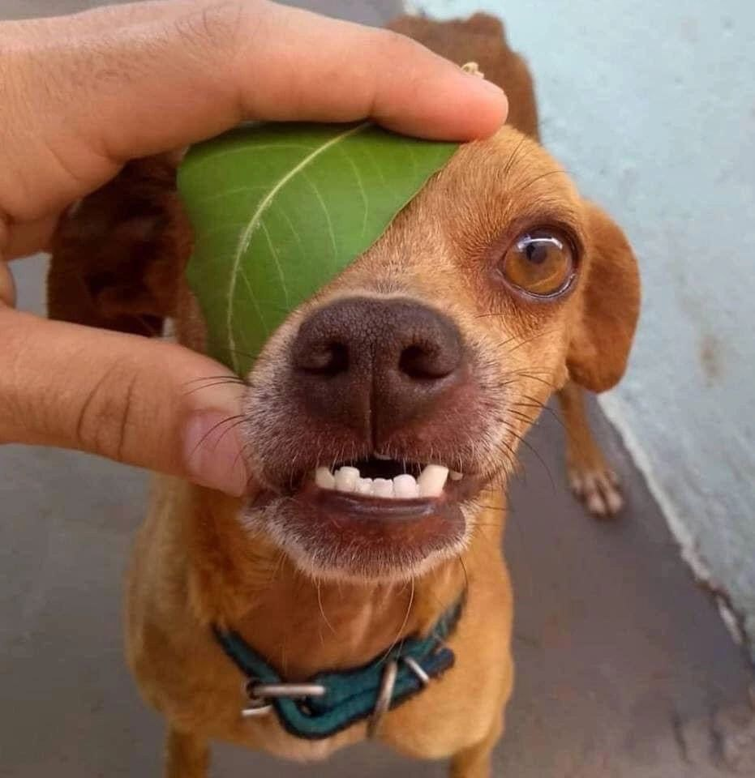

Filipp Podriadov

### Contacts

- Email: *im@filipp.su*
- *[Github](https://github.com/holy-filipp/)*
- Discord: *Filippe (@holy-filipp)*

# Curriculum vitae

## About me

My name is Filipp Podriadov aka Holy Filipp. I'm 18 y.o. \
I've been learning to write code about 4 years, but when I was 11 years old I tried to write an operating system simulation in PHP Devel studio :D. \
I mainly write addons for Garry's mod game in Lua programming language. In last few years I keen in web development, but my old hobbie keeps up with me. \
Briefly about me, I don't like to do courses, I'm more into figuring things out on my own. In spite of this, I have been studying English for 8 years. I can quickly find a solution to a problem on the Internet in English, read documentation. I am motivated and persistent. I have nothing else to say.

## Skills
- Garry's mod Lua
- JavaScript and Node.js
- HTML
- CSS
- Python
- A little bit of PHP
- PostgreSQL
- MongoDB
- SQL
- Linux
- Bash
- PowerShell
- MVC
- Nginx
- Docker
- Proxmox
- Git and Github
- Semver
- NPM
- JavaScript libraries:
    + React.js
    + Express.js
    + Redux
    + Pino
    + Yup
    + Prisma ORM
    + The rest of the bunch of little libraries can be unwritten

## Code example from Codewars

### Task

Write a function that takes in a string of one or more words, and returns the same string, but with all words that have five or more letters reversed (Just like the name of this Kata). Strings passed in will consist of only letters and spaces. Spaces will be included only when more than one word is present.

Examples:

    "Hey fellow warriors"  --> "Hey wollef sroirraw" 
    "This is a test        --> "This is a test" 
    "This is another test" --> "This is rehtona test"

### My solution using JavaScript

```js
function spinWords(str){
  const splitted = str.split(' ');
  let res = [];
  
  splitted.forEach(s => {
    if(s.length >= 5) {
      res.push([...s].reverse().join(''));
      return
    }
    
    res.push(s);
  })
  
  return res.join(' ');
}
```

## Education

- 9 grades of school
- Now in third year of college

## English

I have been doing additional English for 8 years, 4 years of those 8 years working with a native speaker. The last year I haven't studied additional English, so I can forget some things.